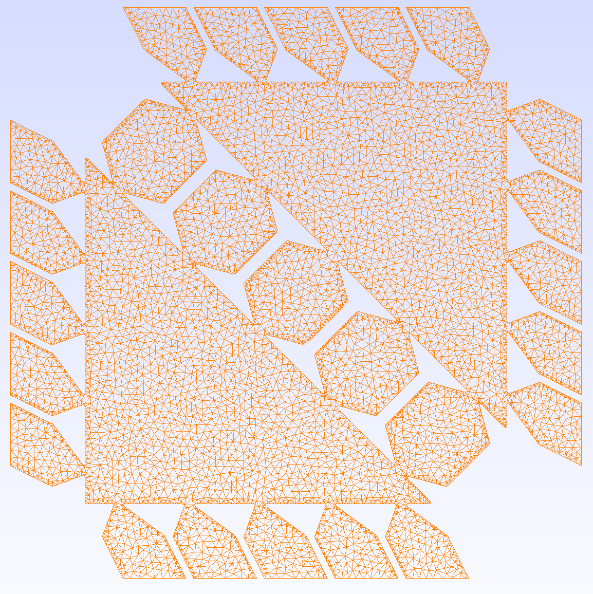
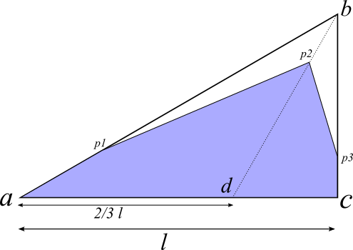

# New types of topology

In this README file, our objective is to describe the new topologies and shapes
experimented for obtaining a larger range of (Poisson ratio, Young's module)
values for the 'Microstructure' project, when comparing to the results presented
in ["Elastic textures for additive fabrication"](http://mrl.nyu.edu/~dzorin/papers/panetta2015et.pdf)
and ["Worst-Case Stress Relief for Microstructures"](http://mrl.nyu.edu/~dzorin/papers/panetta2017et.pdf).

Most of the new structures tested use a different kind of tiling: hexagonal.
This makes it easier to achieve isotropy and seems to make possible to get closer
to our desired ranges.

## Theoretical bounds
First, let's give a brief introduction to the theoretical bounds we consider in
our experiments. (see more in ["New class of extremal composites"](https://www.researchgate.net/profile/Ole_Sigmund/publication/223322250_New_class_of_extremal_composites/links/53cfa0f10cf2f7e53cf81a95.pdf))

There are know bounds for the (shear, bulk) pair for two-phase isotropic
composites:

, where $\kappa^{(1)}$ and $\kappa^{(2)}$ are the bulk modulus of the two
materials used, while $\mu^{(1)}$ and $\mu^{(2)}$ are their shear modulus.
In our case, since we are only considering one material we can consider material
1 as void and $\kappa^{(1)} = 1$, $\mu^{(1)} = 1$. Then, $\kappa^{(2)}$ and
$\mu^{(2)}$ are the properties of our base material.

Then, we reach the following formulas for our lower and upper bounds:
$$
\kappa_{lower} = 0\\
\kappa_{upper} = \kappa_{base} + \frac{1-\rho}{\frac{\rho}{\kappa_{base} + \mu_{base}} - \frac{1}{\kappa_{base}}}
$$

$$
\mu_{lower} = 0\\
\mu_{upper} = \kappa_{base} + \frac{1-\rho}{\frac{\rho (\kappa_{base} + 2 \mu_{base})}{2\mu_{base}( \kappa_{base}+\mu_{base})} - \frac{1}{\mu_{base}}}
$$

Chart below shows the theoretical limits for volumetric fractions of 0.1, 0.2,
$\dots$ and 1.0:

Moreover, using the formulas below, we can find the theoretical limits also for
the Young's modulus vs Poisson ratio chart:

$$
  \kappa = \frac{E}{2(1-\nu)}\\
  \mu = \frac{E}{2(1+\nu)}
$$

Then,
$$
  E = 2\kappa (1-\nu)\\
  E = 2\mu    (1+\nu)
$$

So, if $\kappa$ is constant, we have $E = C_1 - C_1 \nu$ (where $C_1$ is a constant).
This means that we will have a decreasing straight line in the Young vs Poisson
chart. Notice that both linear and angular coefficients are the same and equal to
$C_1 = 2 \kappa$.

In the same manner, if $\mu$ is constant, we have $E = C_2 + C_2 \nu$ (where $C_2$
is a constant).
This means that we will have an increasing straight line in the Young vs Poisson
chart. Notice that both linear and angular coefficients are the same and equal to
$C_2 = 2 \mu$.

This idea can be used to compute the theoretical limits in the Young and Poisson
chart. We can do this because the limits in the shear vs bulk modulus happen
at constant shear or bulk. We achieve then the following chart for volumetric
fractions of 0.1, 0.2, $\dots$ and 1.0:

### Note about our charts
  We saw that straight lines aligned to the axis in the shear vs bulk chart implies
  a straight line in the young vs poisson chart. Is the way back true?

  When we have a decreasing line passing through $E=0$ at $\nu=1.0$, the absolute
  value of the angular and linear coefficients is the same. Then, we will have
  a line in the shear vs bulk chart aligned with the y axis. The same goes for
  lines passing through (-1.0, 0.0), but now for the x axis in the shear vs
  bulk chart.

## hexagon with pillars:
  The idea of this type of topologies is to experiment with the topology
  presented in Sigmund's paper ["New class of extremal composites"](https://www.researchgate.net/profile/Ole_Sigmund/publication/223322250_New_class_of_extremal_composites/links/53cfa0f10cf2f7e53cf81a95.pdf)
  (See microstructure number 9 in Figure 7).

 1. Rectangle pillars:

 Figure below shows the inflated structure on a 2x2 square. Notice that the
 figure shows the warped structure and not the original structure on the
 parallelogram tiling.

 

 To better visualize, we can show how the tiling of four of such structures appears:

 

 We experimented with this structure and obtained very interesting results.
 Below, see the charts of Young's module vs Poisson ratio and shear modulus vs
 bulk (meshes and result tables are in 'davi-repo' branch in folder
 'tools/hex-creator/experiments/hexa-pillars'):

 

 

 These results show that the achieved elastic properties are closer to the
 theoretical limit than the ones obtained by the patter 98 when using squares
 tiling. For these experiments, we used script 'hexa-many-pillars-creator.py',
 with parameters described below (see figure below):

 

  * side of triangle: 1.0 to 1.8 (represented by 's' in the picture)
  * number of pillars: 10 to 50 (steps of 10) (picture shows an example with 4 pillars)
  * thickness of each pillar: 20 values between the maximum possible value (so
    pillars would not intersect) and half of this value (thickness represented by
    't' in picture).

  Later, we verified how the elasticity properties respond when varying the
  number of pillars, but keeping the same volume fraction. This is done by
  keeping the same triangle side but varying the thickness of each pillar, in
  such a way that the non-void area is the same.
  Results can be seen in folders 'storyline-manypillars-sX', where X contains
  the triangle side value. Below, we show charts for triangle side equal to 1.4
  and number of pillars varying from 1 to 15. In this case, volume fraction is
  0.88 and we also show in the charts the theoretical bounds for this fraction
  value. (Note that the limits are different according to the volume fraction.)

  

  

  The numbers in both charts represents the number of pillars. We see from the
  shear vs bulk chart that, as expected, the shear modulus decreases when
  increasing the number of pillars. Also, the bulk modulus does not vary much,
  staying in the range from 80 to 95 when using more than 5 pillars. This agrees
  with our intuition, that adding pillars instead of a unique connection will
  make it easier to shear, since each pillar can move independently. Also, it
  makes sense that the bulk modulus continues practically the same, since the
  amount of material connecting the triangles is the same and in the same
  direction.

  This change in bulk and shear means also a change in Young's module
  and Poisson ratio. Since the change in 'shear vs bulk' is mostly vertical, the
  result in 'young vs poisson' will be close to a straight line with negative
  angular coefficient. Notice that increasing the pillars means reducing the
  Young's module and increasing the poisson ratio. Also, one can observe that
  the elasticity properties are getting closer to the theoretical limit when
  increasing the number of pillars (but for lower values of Young's module).

  So, we would expect that, for achieving a result close to the theoretical
  bounds for a high E value, we should use a larger triangle in the
  microstructure, achieving an initial Young's module closer to the top.
  This is seen when using triangle side equal to 1.5, as shown in the figures
  below. In this case, volume fraction is 0.9125.

  

  

 2. Quasi-pillars:

 We also implemented a structure called quasi-pillars, in which the region of
 contact between pillars and triangles is reduced in order to reduce the shear
 modulus, hoping that this can achieve values in the Young vs Poisson chart
 closer to the boundary. The figure below shows how this was done:

 

 The result is shown in the pictures below:

 

 

 For producing these structures, the script 'hexa-quasi-pillars-creator.py' is used.

 Then, we also implemented a script ('pillar2quasipillar-storyline.py') to verify,
 given an initial pillar structure with satisfiable elasticity results (where
 values are close to theoretical boundary), what happens when we slowly reduce
 the connection width between pillars and triangles. The script tests a number
 of widths between 0.005 and the original pillar thickness.

 We tested the script with out instance 'hexagon-pillars-n10-s1.4-t0.0786.msh',
 which has 10 pillars, thickness equal to 0.0786 and triangle side of 1.4.
 We experimented with 10 different values for the connection thickness and the
 results are shown below:

 

 

 On one side, as expected, results show that, when reducing connection region,
 we also reduce shear. This should be good to achieve better values of Poisson
 ration and Young's module. However, the decrease in resistance to
 compressibility seen through the bulk modulus values is very significant,
 not helping in achieving elasticity properties closer to the theoretical
 boundary.

 Instances and results of this experiment can be seen in 'davi-repo' branch in
 folder 'tools/hex-creator/experiments/hexa-quasipillar/'

 ### PS. fast decrease of bulk modulus when decreasing connection thickness
 Note that the Young vs Poisson curve is almost a straight line and passes
 very close to $(0.0, 1.0)$. Then, we would expect that our shear and bulk chart
 would appear like a straight line parallel to the y axis. However, this is not
 what is seen in the second chart. I decided then to investigate this issue.

 First, I computed the linear regression passing through (poisson, young) points.
 I obtained the following curve $E = -127.72 x + 126.25$. Then, I plugged this
 into $\kappa = \frac{E}{2(1-\nu)}$ and $\mu = \frac{E}{2(1+\nu)}$. I obtained:

 $$
  \kappa = 63.86 - \frac{0.735}{1-\nu}
 $$

 Notice that, for our case, $\kappa$ will not be constant. In fact, the closer
 the value of $\nu$ to $1.0$, the faster $\kappa$ will decrease. Since we are
 computing values for poisson close to the upper limit, this will be a problem.
 See below the charts with their respective regressions. (The shear x bulk curve
 was obtained by plugging the linear approximation
 ($\kappa = 63.86 - \frac{0.735}{1-\nu}$) into the computations of bulk and
 shear modulus.

 

 

 3. Diamond pillars:

 Another variant of the pillar structures is obtained by using a diamond shape
 instead of the rectangular one used in the original structure. The idea here is
 that the short connection between the pillars and the triangles will give
 smaller values for shear, while not changing so much resistance to
 compressibility (bulk).

 The figure below shows how this was done and the parameters considered:

 

 Obtaining something like shown in the example below:

 

 Then, we experimented with this kind of structures (still in progress). We
 considered the following range of parameters:
  * side of triangle: 0.8 to 1.6 (represented by 's' in the picture)
  * number of pillars: 5 to 25 (steps of 5) (picture shows an example with 4 pillars)
  * thickness of each pillar: 20 values between the maximum possible value (so
   pillars would not intersect) and half of this value (thickness represented by
   't' in picture).

 The results can be seen below. Green shows the structures with 5 pillars, while
 purple shows the case for 10 pillars, red for 15 and blue for 20:

 

 

 These charts show that, in fact, a very low shear value is obtained for each
 of these structures (max below 5). However, the bulk modulus ends up being
 limited, which also affects how high the Young's module is.

 4. Sear pillars:

 Finally, we also experimented with a structure with a very short connection between
 triangles and pillars, but a rapid transition (45 degrees) to a shape as wide
 as the original pillar shape.

 The parameters for this case are seen below:

 

 See an example:

 

 Then, we experimented with this kind of structures (still in progress). We
 considered the following range of parameters:
  * side of triangle: 0.8 to 1.6 (represented by 's' in the picture)
  * number of pillars: 5 to 25 (steps of 5) (picture shows an example with 4 pillars)
  * thickness of each pillar: 20 values between the maximum possible value (so
   pillars would not intersect) and half of this value (thickness represented by
   't' in picture).

  The results are shown below:

  

  

  The outcome is better than seen with diamonds, with more strong material,
  as seen from the bulk modulus result. However, they are not as good as seen
  with the original pillars (TODO: add picture to show this).

## hexagon/squares similar to clovers:
  The idea of this type of topology is to provide a very small connection in the
  center of the clover and short regions connecting neighbor structures, in a way
  that the leaves could move with freedom, shrinking and stretching the overall
  object.

 1. Square shape:

  First, we show how the base unit (considering the orthotropic symmetry) is
  planned.

  

  The resulting structure is shown below:

  

 2. Hexagonal shape:
  For the hexagonal tiling case, we again used the simplex for describing the
  shape of the final structure. See the following picture:

  

  Notice that points _p1_, _p2_ and _p3_ are enough to describe the shape we want.
  _p1_ can be given as a linear interpolation of _a_ and _b_. The same happens
  for _p2_ using points _b_ and _d_ and for _p3_ with points _b_ and _c_.

  An example of the resulting microstructure in the 2x2 square is shown below:

  

  See how the resulting microstructure in the hexagonal tiling works below:

  

  A script was created to produce a series of these shapes and test their
  elasticity properties. We used here three parameters that represent the
  interpolation factor used to produce _p1_, _p2_ and _p3_.
   * ab positioning: how close to _a_ should _p1_ be? 10 values between 0.75 and 0.99
   * bd positioning: how close to _b_ should _p2_ be? 10 values between 0.5 and 0.98
   * cb positioning: how close to _c_ should _p3_ be? 10 values between 0.75 and 0.99

  Unfortunately, the results were not very good and far from the theoretical triangle
  in the young vs poisson chart (and close to the base material poisson ratio),
  as seen below:

  

## Auxetic attempt material:
 The idea here is to mimic the design seen, for example, in Kaminakis et al.
 paper ["Topology optimization for compliant mechanisms, using
 evolutionary-hybrid algorithms and application to the design of auxetic materials"](http://www.sciencedirect.com/science/article/pii/S1359836812002338).

 1. Square tiling:
     1. Rectangle pillars:

     

     2. Diamond pillars:

     

 2. Hexagonal tiling:

 
